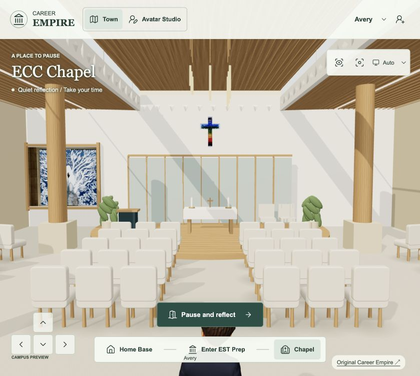
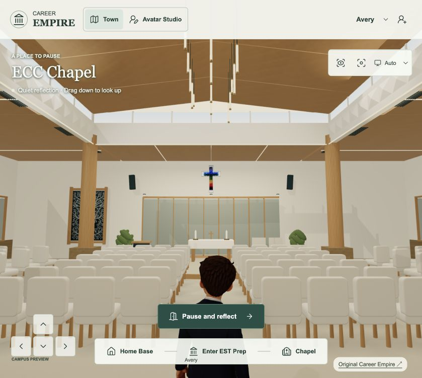
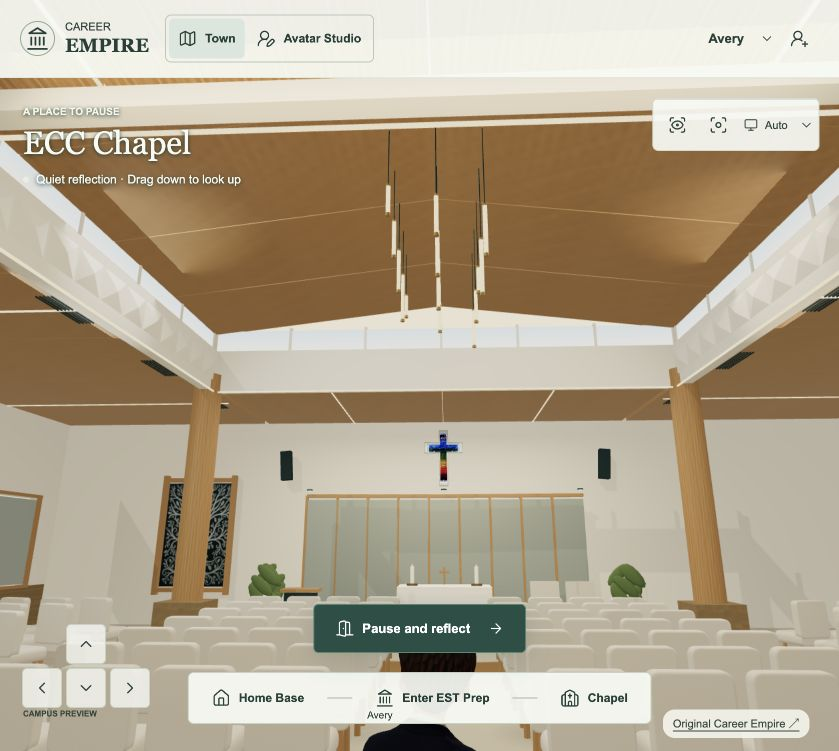
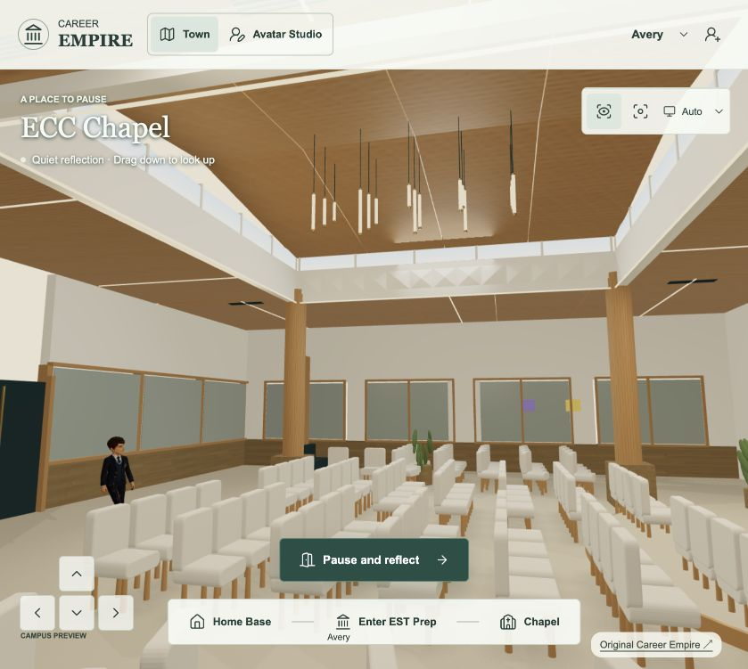

# ECC Chapel interior upgrade — 13 September 2026

Tania explicitly accepted exterior revision5 (“I love it”) and authorised the Chapel interior upgrade and live publication, coordinated with the other campus release task. Reference sources: her ECC-Chapel-4/5/6.jpg, archived unmodified in private/production-evidence/2026-09-13/chapel-interior-upgrade.

Plan: preserve Chapel reflection gameplay and recognizable altar/rainbow cross, folding frosted screens, upholstered seats, round timber columns, white faceted clerestory and warm timber ceiling. Refine material grain, lighting, ceiling panelling/linear and suspended lights, and architectural detail. Show ceiling from normal player view and add vertical look within the Chapel. Verify normal/raised camera, movement, reflection and exit, mobile layout, and publish through the existing release owner after exact receipt. No new Blueprint or project.

Baseline captured. Current room is overlit by hard directional shadows, materials are flat, and only horizontal camera drag works. Exterior acceptance recorded; retain all other work. Implementation underway.

## Verified interior candidate
Raised segmented timber ceiling, continuous light ribbons and 15 staggered pendants; warm soft area lighting and local room reflections; woven upholstery/carpet, frosted-glass ripples and metal-mounted original rainbow cross; 78 instanced chairs; vertical look and clear Chapel overview.

The original altar reference supplies the rainbow-cross pixels. The existing reference-derived woman/tree artwork is reused with its portrait proportions preserved. Original ECC-Chapel-4/5/6.jpg are archived unchanged. This is a playable interpretation of the supplied room, not a survey-accurate reconstruction.

Ceiling is rebuilt as jointed raised timber panels with clerestory glazing; floating seam bars are removed. All four timber columns, sanctuary folding screen, coloured cross and altar remain present in the final reviewed scene. Entry camera shows ceiling and sanctuary together. Drag down to look up; Recenter restores the view. Chapel overview uses a clear aisle angle. Reflections are captured from the actual room once per load, not from an outdoor-only environment.

Materials, seating and architecture share resources. Static meshes are batched by material/shadow behavior. 78 seats use instancing; room has 38 mesh objects after batching. Entrance sample: 37 draw calls/113,958 triangles. 15 decorative pendants use emissive materials; four area lights add no shadow maps. Existing one directional shadow remains. Added official Three.js r180 RectAreaLightUniformsLib/RectAreaLightTexturesLib (matching vendored renderer), approximately 310KB total source; license headers retained. Source URLs: https://raw.githubusercontent.com/mrdoob/three.js/r180/examples/jsm/lights/RectAreaLightUniformsLib.js and RectAreaLightTexturesLib.js in the same directory.

14 unit tests and source checks pass. Actual Rapier routes pass for central/left/right aisles, reflection approach and return to door. Browser checks: direct entry, ceiling look-up, recenter, overview, reflection modal/close, Home Base return, and 390x844 with no horizontal overflow. No sustained school-device performance certification or full browser CI claim.

Exact five changed source/dependency files and hashes: private/production-evidence/2026-09-13/chapel-interior-upgrade/receipt.json. This receipt also preserves pre-edit source, references, physics harness/results and review screenshots. Exterior revision5 was explicitly accepted by Tania; interior publication explicitly requested. Combined release task owns deployment. Current candidate not yet claimed live.

[Playable interior preview](http://127.0.0.1:4285/playable-3d/?view=chapel-interior)

Shape correction requested by Tania: ECC-Chapel-4 is the SIDE perspective. Supersede provisional long central ceiling strip and narrow wings: build a bounded central raised clerestory roof, deep white supporting frieze, lower timber ceilings on all four sides, wider congregation space and seating wings. Underlying shell, ceiling and walk bounds are being corrected together. Previous candidate receipt is not release-ready; release owner notified.

## Verified interior candidate
Broad 22m by 18m room with a bounded central raised clerestory roof, lower timber ceilings on all four sides, deep white relief beams and wide glazed seating wings, continuous light ribbons and 15 staggered pendants; warm soft area lighting and local room reflections; woven upholstery/carpet, frosted-glass ripples and metal-mounted original rainbow cross; 98 instanced chairs; vertical look and clear Chapel overview.

The original altar reference supplies the rainbow-cross pixels. The existing reference-derived woman/tree artwork is reused with its portrait proportions preserved. Original ECC-Chapel-4/5/6.jpg are archived unchanged. This is a playable interpretation of the supplied room, not a survey-accurate reconstruction.

After Tania clarified ECC-Chapel-4 is the side perspective, the ceiling is rebuilt as a bounded central raised roof approximately 9.9m by 8.5m, surrounded by lower timber ceilings and high perimeter glazing. These are interpreted proportions, not surveyed dimensions. The earlier long-spine candidate is superseded. Ceiling uses jointed raised timber panels with clerestory glazing; floating seam bars are removed. All four timber columns, sanctuary folding screen, coloured cross and altar remain present in the final reviewed scene. Entry camera shows ceiling and sanctuary together. Drag down to look up; Recenter restores the view. Chapel overview uses a clear aisle angle. Reflections are captured from the actual room once per load, not from an outdoor-only environment.

Materials, seating and architecture share resources. Static meshes are batched by material/shadow behavior. 98 seats use instancing; room has 38 mesh objects after batching. Entrance sample: 33 draw calls/135,166 triangles. 15 decorative pendants use emissive materials; four area lights add no shadow maps. Existing one directional shadow remains. Added official Three.js r180 RectAreaLightUniformsLib/RectAreaLightTexturesLib (matching vendored renderer), approximately 310KB total source; license headers retained. Source URLs: https://raw.githubusercontent.com/mrdoob/three.js/r180/examples/jsm/lights/RectAreaLightUniformsLib.js and RectAreaLightTexturesLib.js in the same directory.

14 unit tests and source checks pass. Actual Rapier routes pass for central/left/right aisles, both widened outer aisles, reflection approach and return to door. Browser checks: direct entry, ceiling look-up, recenter, overview, reflection modal/close, Home Base return, and 390x844 with no horizontal overflow. No sustained school-device performance certification or full browser CI claim.

Exact five changed source/dependency files and hashes: private/production-evidence/2026-09-13/chapel-interior-upgrade/receipt.json. This receipt also preserves pre-edit source, references, physics harness/results and review screenshots. Exterior revision5 was explicitly accepted by Tania; interior publication explicitly requested. Combined release task owns deployment. Current candidate not yet claimed live.

[Playable interior preview](http://127.0.0.1:4285/playable-3d/?view=chapel-interior)

Final appearance accepted by Tania: “great! love it send to live if all good to go”. Seven physics routes, final 14 unit checks and source/record checks pass. Release task notified to publish this exact accepted candidate; no further visual approval needed.

Publication ownership: the exterior release task closed after PR #12. This Chapel task takes over the separately approved interior release in the same canonical checkout; no duplicate project. Refresh only release cache keys and manifest, retain the final approved geometry/materials. Live verification remains pending.

Release review caught a stray undefined `next` reference in the interaction early-return guard. Removed only that duplicate camera-label statement; the correct label update remains in setMode. Four regression cases exercise Studio, EST video, module and Chapel reflection states. Visuals unchanged. Packaged-source hashes supersede app/index hashes only for this correction and release cache keys.

Publication progress: PR #13 merged candidate fcccb9e into main 7388cfa. Initial public hash check correctly found the prior interior still served while Pages queued. All 18 local unit/regression tests and 83 committed package hashes pass. Hosted CI initially failed before any jobs and was retried; current attempt is running. Blueprint asset/production-plan tests pass; broader impact validation still reports the inherited stale AGENTS reader review receipt. This game release does not certify or publish the Blueprint reader.

## Verified Chapel interior publication — 13 September 2026

Tania-approved Chapel interior is live and published-source-verified at 7388cfa3bca6b58a06a88bf18f65e6d49dc17501 (PR #13, candidate fcccb9e). Broad side-perspective room, bounded raised clerestory, timber ceilings, warm pendants/strip lights and reflections, 98 upholstered seats, original rainbow cross and ceiling camera. All 83 public release asset hashes match. 18 unit tests and seven real-physics routes pass. Local entry, ceiling/overview and reflection/Studio return checks pass without captured scenery/runtime errors. Fresh live browser navigation is blocked by an unavailable browser security-check service; no bypass attempted. Actual published files match the tested build. Hosted CI passed 24 browser tests then hit the previously recorded arrival-screen 180-second timeout; 12 did not run. No full CI or sustained school-device certification claimed.

[Open live Chapel](https://emmanuel-ict-support.github.io/GTCEM-Career-Empire/playable-3d/?view=chapel-interior). Drag down to look up; Chapel overview shows the room from the side. Final source, exact hashes and screenshots: private/production-evidence/2026-09-13/chapel-interior-upgrade/live-receipt.json. User requested a pause after this release; no further environment, avatar or curriculum work. Canonical Blueprint reader release and retained source-access gaps remain separate. Earlier interior holds/pending-publication notes are historical.

Closing record checks: seven scoped asset/production-plan tests pass and planning exports are current. Broader reader impact validation retains a stale AGENTS.md review receipt; no complete Blueprint reader release or global refresh is claimed. The missing governing change 49 record was restored to agree with its existing asset/integration entries.
