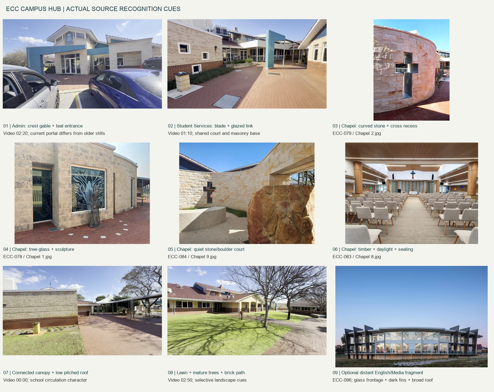
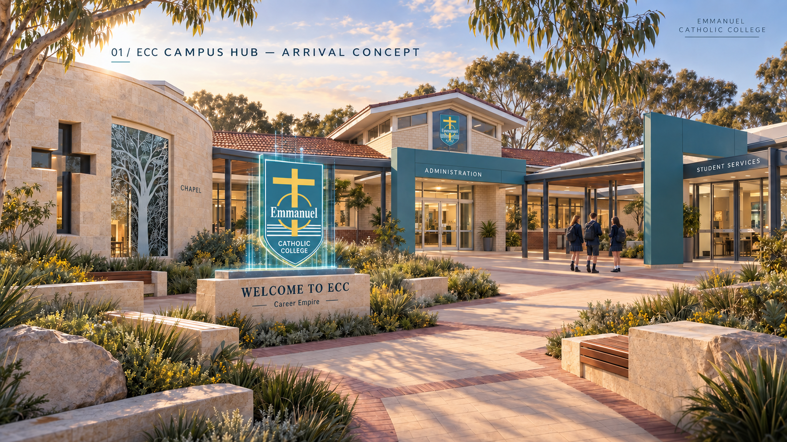
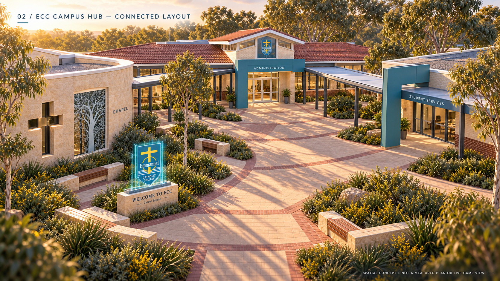
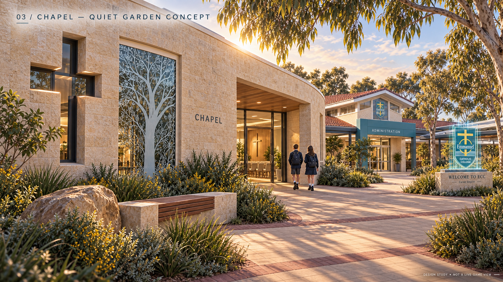
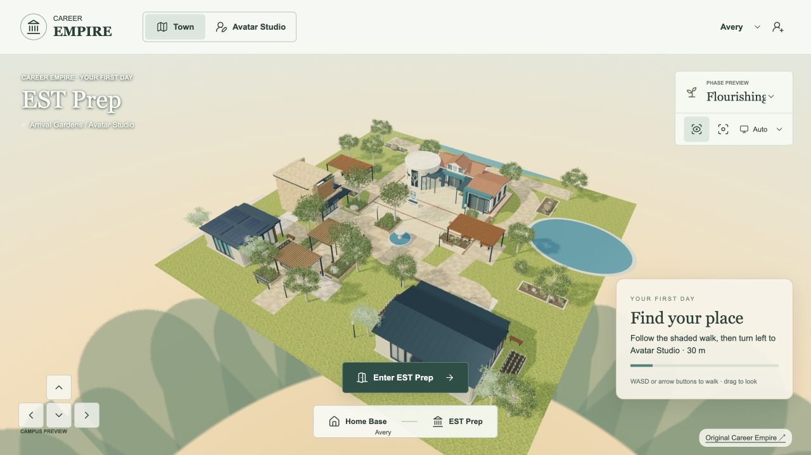
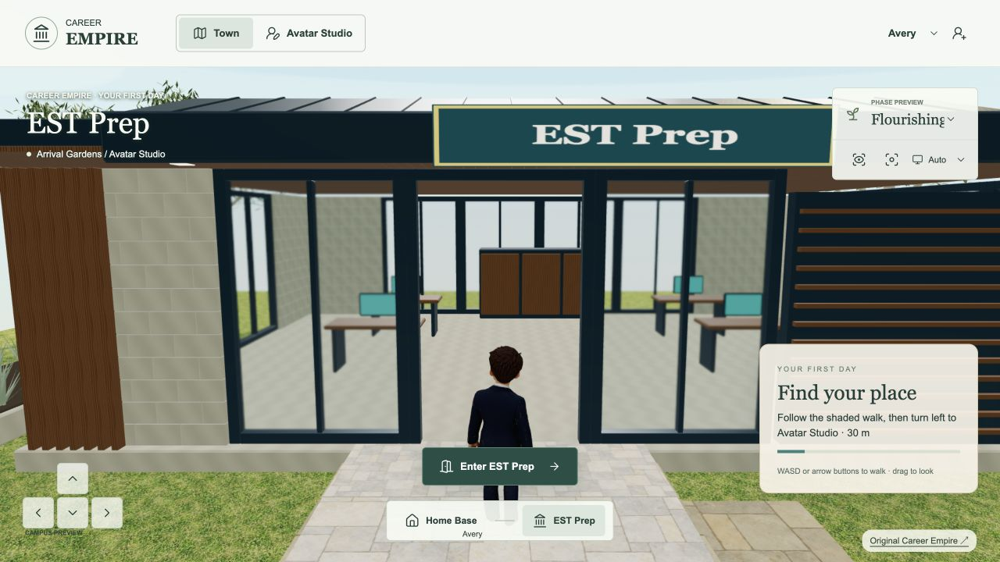
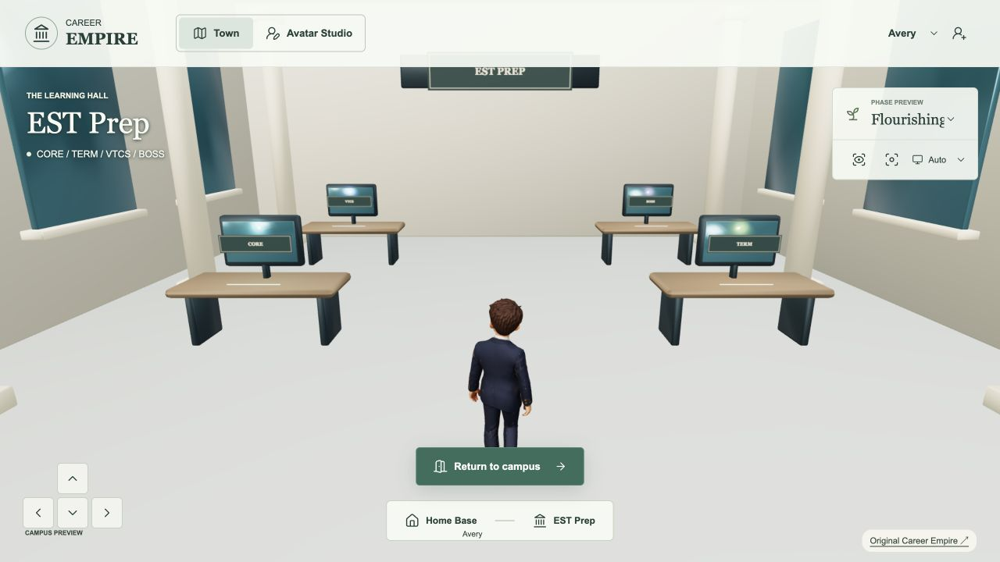

# ECC CAMPUS HUB — VISUAL + FUNCTIONAL SPECIFICATION

10 September 2026 · CE-CHANGE-20260910-37 · **Proposed design, ready for scope review; not a model, accepted appearance or live replacement.**

## Recommendation

Create **one connected ECC Campus Hub** around the combined Administration, Student Services and Chapel complex. Preserve its most recognisable architecture, compress its circulation, and bring the Chapel's curved stone wall and contemplative garden into the main approach. Use a small forecourt and shaded connecting walk to make three purposes legible: **arrive and organise / find support / pause and reset**. Imply the wider school with a few distant fragments and truthful directional signs. Do not recreate the whole campus.

This continues the existing World Environment & Ecosystem milestone. The source-backed specification is the authorised next step; modelling and replacement of the live building are not authorised by this document.

## Evidence and scope of inspection

- Inspected the actual `Megatrends/Assets/ECC Branding` folder, including its `ECC Campus` subfolder. The requested spelling `assets/ECCBranding` does not exist. Originals were not altered.
- Indexed **129 non-hidden files**: 62 decodable images, one 219,994,360-byte video, and 66 saved-page/support files. Includes duplicate images and a saved SharePoint page with supporting scripts; this is not 129 architectural references. Every file has a private SHA-256 inventory; all 62 images were visually inspected through 11 labelled contact sheets. The saved-page/support files are classified as ancillary web data, not architectural evidence, and were not executed.
- `IMG_8620.MOV` (ECC-111): 1920 × 1080, **191.09 seconds**. Inspected 20 evenly spaced representative frames, 00:00–03:10, and full-size detail frames at 01:10 and 02:20. This is a sampled visual walkthrough, not a survey, measured plan or claim to have examined every frame/audio track.
- The video joins the covered-walk/Chapel side, Student Services court, lawn-facing wings and Administration frontage in one continuous route. It establishes connected character and adjacency, but not cardinal orientation, hidden room boundaries, exact dimensions or each wing's room use.
- Inspected the actual live game's arrival, aerial view, current hero entrance and Studio approach in the browser; compared current source in the **existing release worktree** at game commit `d85de9920f23f9f18288c42eed2e86dcfc9da1b1`. The older `game-live` checkout is not the latest live content. Recorded live screenshots are fresh inspection evidence, not a new regression or performance certification.
- Read canonical `productionPlan`, handoff, refresh checkpoint and style guide. Inspected the actual CE-CAMPUS-01, CE-CAMPUS-02 and CE-STUDIO-CONCEPT-01 image files: cinematic stylised realism, substantial warm masonry, navy framing, timber, glass, layered planting and shaded connected routes. Their waterfront/skyline and speculative geometry are **not evidence of real ECC**.
- No new global refresh success: `lastSuccessfulRefreshAt` remains unset. Existing gait, lighting, hosted-test timing failures and retained integration backlog remain separate.

The numbered evidence IDs below resolve to exact filenames and hashes in the private `asset-inventory.json`. Full timeline sheets and original-image contact sheets remain in the canonical private evidence folder. Building photos control recognition; the current Career Empire concepts control rendering quality and environmental cohesion. Older QCE hologram imagery is historical visual material, not permission for neon campus architecture or invented school crests.

## 1. Recognition cues: preserve versus adapt

| Cue and actual evidence | MUST PRESERVE in the game interpretation | Simplify, exaggerate or recompose |
|---|---|---|
| **Layered roof silhouette.** Video 00:00–00:10, 01:30–02:20 and 02:40–03:10; ECC-106/107 `Front Office and admnistration…jpg`. Low red-brown tiled pitched roofs, white eaves, gable ends and raised glazed roof sections. | A low connected roof family with selected raised gable/clerestory accents. Keep recognisable terracotta/red-brown roof fields on the hero, pale edges and a legible crest-bearing entrance gable. | Reduce repeated bays and tile geometry; bake tile detail. Slightly raise the key gable for approach visibility. Do not turn every roof navy simply to match the Studio, or replace this family with a civic cupola. Exact pitches/heights require a blockout study. |
| **Masonry contrast.** Video 01:10 and 02:20; ECC-079 and ECC-103/106. Cream brick to office wings, red-brown brick plinth/band, more irregular pale stone on Chapel curve and entrance surrounds. | Distinguish cream brick from textured pale stone; retain the warm red-brown base and measured masonry scale. | Reuse limestone texture infrastructure, with new brick/stone variants where required. Reduce joint detail with distance. Do not label every pale surface the same limestone construction. |
| **Administration identity.** Video 02:00–02:20; ECC-106/107 show an older frontage without the same modern frame. Raised central gable and glazed upper section with crest; glass double doors; broad asymmetric blue-teal portal with vertical ADMINISTRATION lettering. | The current video's portal + pale entrance surround + raised crest gable, with recessed glass entrance. Treat the video as stronger evidence for current frontage than undated older stills. | Compress wings and carpark setback. Rebuild accurate text separately from textures; use a verified crest original, never QCE's distorted generated crest. Simplify mullions without losing the upper glazed band. |
| **Student Services marker.** Video 01:10 and 03:10; ECC-103 and ECC-108 corroborate the broad frame. Tall teal blade with vertical STUDENT SERVICES lettering, horizontal beam, white fascia, slender posts, glazed wall and raised planting edge. | This recognisable portal and readable service entrance must remain distinct from Administration. Preserve a shared covered threshold and planted forecourt. | Rotate the entrance toward the game forecourt. Use fewer structural bays, move functional label into a horizontal companion plaque for player readability. Rooftop HVAC, exposed maintenance kit and exact small-window counts are low value. |
| **Chapel exterior curve.** Video 00:20–01:00; ECC-078/079/084/087. Curved pale stone wall, deep cross-shaped opening/inset, tree-patterned glazing with human/figure-like motif, adjacent freestanding sculpture and small stone/boulder court. | The curved stone volume, cross opening, a distinctive tree-glass panel and quiet side court are the Chapel's primary recognition set. Preserve their relationship as a calm, discoverable edge of the connected complex. | Bring the curve forward and turn it toward the approach; exaggerate cross recess depth enough to survive game lighting. Simplify sculpture geometry but do not invent a sacred figure's identity. Tree-glass artwork needs a clean supplied source or faithful trace from the reference at asset stage. |
| **Chapel interior character.** ECC-080/081/082/083/085/086. Warm timber ceiling and round timber columns, raised clerestory light, pale walls, upholstered light chairs, restrained coloured cross, timber/glass altar backdrop; patterned glazing projects a recognisable shadow. | For the eventual small playable room: daylight from above/side, timber warmth, quiet seating, cross and a tree-glass focal point. Keep recognisably Catholic chapel character; no generic spa or sci-fi recharge booth. | Compress the large seating hall to a small sanctuary, preserve visual depth with a shallow backdrop, reduce chairs/ceiling lights. Full altar fittings and exact chair counts are not needed for the first exterior. |
| **Linked covered walks.** Video 00:00–01:10 and 03:10. Narrow grey metal posts, gently arched/curved canopy runs, eaves and glass links. | A believable roofed connection between the three parts, continuous ground contact and clear doors. | Shorten corridors and bends. Reuse structural-post patterns, but make the characteristic curved canopy as a dedicated module; existing timber pergolas are suitable in the wider garden, not substitutes for this recognition cue. |
| **Forecourt and landscape.** Video 00:00–00:50, 01:20–01:50, 02:30–03:10. Red brick paths, broad lawns, low foundation planting, mature branching trees, small flowering beds, stone edges, shaded seating and occasional bollards. | A compact red-brick threshold within the established pale campus paving; lawn and mature canopy framing rather than an isolated display platform. | Reuse approved plant components and benches; compose denser layered beds to the accepted game direction. Seasonal bare trees in the video do not require reproducing that season. Omit fluorescent post tapes, bin positions and drains unless needed for a playable interaction. |

**Proportion rule:** retain the long, low connected complex and a few taller roof accents. The Chapel gains prominence through curvature, daylight and clear space, not an invented steeple or a massive tower. No numerical dimensions are claimed from wide-angle footage.

## 2. Hero building composition

**Proposed arrangement, not real campus geography:** Chapel toward the west/southwest side of the northern hero area, Administration near the centre, Student Services to the east. A shared shallow forecourt faces the established fountain/arrival spine. Fold the actual walk into a shorter connected U/offset line so the Chapel curve, crest gable and Student Services portal can be read together in a three-quarter view.

The raised Administration gable provides the familiar school identity; the curved Chapel end provides the distinctive silhouette. Student Services makes the complex feel inhabited through glazing, a reception glimpse and a sheltered waiting threshold. Avoid three separate freestanding boxes with three signs.

**Initial fit-study envelope:** approximately x = −9…9, z = −19…−9, with local forecourt to about z = −5. These are provisional **game world units**, not surveyed metres or an approved footprint. The current Town Hall/EST anchor is (0, −14), with a 16 × 6.7 main blocking volume and a forward entry volume; replacement must be tested against actual mesh bounds and route clearance. Keep the north path centred at z = −22, west route around x = −11 and east route around x = 13 legible. The existing trees at (−8, −18) and (8, −18) conflict with this proposed envelope: relocate their instances locally if the scope is accepted, retaining their approved models. Do not silently clear the whole landscape.

Retain global spawn (−7, 23.3), Studio at (−17, 5), fountain at (0, 4), Careers Advice Centre, First Workplace, eastern pond and northern water boundary. The water is part of the existing game composition, not a claim about ECC's location.

**Material hierarchy:** warm cream/pale masonry dominates; red-brown roof and brick base supply school familiarity; white eaves and muted teal entrance frames carry identity; navy and timber connect the new hub to the established world. Limit bright teal to small interaction accents. The current warm daylight is the initial comparison baseline; the separate unpublished lighting candidate is not implicitly accepted.

## 3. Wider campus: what earns physical space

| Real area/reference | Recommended representation | Reason and boundary |
|---|---|---|
| Administration + Student Services + Chapel | Full external connected hero; entrance recesses; later a small Chapel interior and compact reception spaces | Highest combined recognition and immediate navigation/support value. No full office fitout. |
| Chapel quiet court and forecourt | Physical low stone edge/bench, one boulder, planted pocket, cross/tree-glass sightline | Extends reflection gameplay outdoors and supports a quiet route without a whole new building. |
| Covered school walks, lawns and garden edges | Physical short connectors, planted borders and one framed view beyond | Gives the complex its familiar school scale and spatial relationship. |
| English/Media/library frontage (ECC-093/094/096/098/099/101) | **One optional distant facade fragment**, only after the hero passes review: two-storey glass band, broad pale curved roof edge, dark projecting fins; otherwise signage | Strong recognisable architecture, but a second large glass hero would compete with the main complex. The supplied interiors show library seating; exact department/room allocation is not proven by filenames. |
| SPACE (ECC-112/113/114/117/118/119) | Directional sign in phase one; optional low background mass with a dark blue panel and recognisable white motif later | Sport/performance/community potential, but no activity currently requires its full hall or courts. Images include a sports hall and varied facade views; do not infer all are one continuous room. |
| Mural facade (ECC-115/116 and campus contact sheets ECC-088/089) | Optional small background fragment after location/artwork source is confirmed | High visual character. Its exact building identity is not established in the asset set; do not assign it to a guessed facility or invent derivative cultural artwork. |
| Home Economics (ECC-109) | Signage only; reserve future practical-learning route | Image appears to be an architectural visualisation, not proof of current built condition. No kitchen model from this evidence alone. |
| “Hospitality building” (ECC-110) | No separate physical building; record source-label uncertainty | The visible content is library-style chairs/bookshelves, not a hospitality kitchen. |
| Oval, courts and classroom rows (small aerial/contact evidence) | Directional sign and restrained lawn/horizon implication | Large spatial cost and no approved near-term gameplay. No full oval, classroom grid or invented academic precinct. |
| Administration carpark | Omit from playable hub; a modest edge/bollard cue is sufficient | Cars obscure the real facade and add little to the intended on-foot hub. Keep player arrival within the existing gardens. |

Place a small directional sign at the forecourt: Administration, Student Services, Chapel; secondary directions to English & Media / Library, SPACE and Oval only where the design actually points to a visible path/background. Unbuilt destinations should not display an active-entry prompt. Use optional ambient school sounds later, subject to performance/accessibility review; this specification commissions no audio or NPC crowd.

## 4. Proposed functions and entrances

All functions below are **future proposals**, not implemented services, accepted curriculum mappings or approved economy values.

| Place | Entry and future activity loop | Evidence, feedback and return |
|---|---|---|
| Chapel / reflection | Step-free side entrance off a quiet pocket, visible from the main approach. Choose a short pause, guided attention/breathing prompt or a fictional stressful-situation reflection; select a practical coping response, receive brief supportive feedback, then resume the previous activity. Allow skip/exit. | Potential restoration of simulated focus/energy/wellbeing is reserved, with no numerical award, cooldown or tax/economy change set here. Do not reward religious participation or require worship for progress. Personal reflection stays optional; do not collect health disclosures or expose them to a leaderboard. If a classroom activity later needs evidence, retain the fictional strategy choice and learning rationale under the agreed evidence contract, not inferred wellbeing diagnoses. |
| Student Services | Main student-facing portal, waiting bench and reception glimpse. Choose the appropriate help route, prepare a support request or plan a manageable next step in a fictional workload challenge. | Feedback explains why the route fits; later save an action plan/checkpoint and return to the originating task. Teacher-visible learning evidence needs explicit mapping and review policy. No real counselling bookings or student-record access is created. |
| Administration | Crest-bearing entrance, a compact reception counter and orientation notice. First-visit orientation, campus wayfinding, information-checking or a respectful enquiry scenario. | Save a completed orientation/checkpoint or fictional enquiry choice. Keep it distinct from the existing Careers Advice Centre's career-planning role. No real attendance/enrolment administration. |
| Shared forecourt | Choose between the three purposes; identify a destination before walking; sheltered waiting/meeting point. | Readable sign and contextual prompt; no forced branching tutorial, unlock schedule or extra reward currency. |

**Critical retained function:** the current Town Hall is the actual **EST Prep** portal, not an empty decoration. Its route is reached at (0, −8.35) and leads to the existing separate interior/CORE/TERM/VTCS/BOSS navigation. In the first future replacement, retain that working route and destination control as a clearly labelled **EST Prep access through the shared student lobby**. Do not send EST users into Chapel reflection or remove the existing module route. A later spatial redesign can move the entrance only with explicit destination, trigger, collision and return-anchor changes and regression proof.

Entrances must be visually different and named; share a consistent interaction pattern. Suggested design targets: 1.8–2.0-unit clear doors, at least 2-unit clear approach with turning room, broader 3–4-unit main connector, level threshold where possible. These are game-design allowances, not building-code certification. Current character autostep is 0.27 units; avoid requiring it to climb decorative steps. Interior loading should be on demand; leaving any room restores the right external doorway, yaw and current objective.

## 5. Arrival, cameras and key sightlines

Do not move the global start again. The hub has a **secondary arrival moment** on the path from the fountain, around (−3, −4), opening into the forecourt. Chapel curve should appear first on the left, with Administration's crest/roofline and Student Services marker visible beyond. Keep planting below key signs and route sightlines; frame the Chapel with two canopies rather than obscuring its glass.

Save these fixed views before any geometry changes. Use the same viewport, world phase, quality, FOV and lighting for before/after pairs. Freeze all final camera values at the first fit study; do not “improve” a failed comparison by changing the camera.

| Gate view | Fixed initial definition | What must be legible |
|---|---|---|
| V0 whole map | Existing aerial camera (27, 36, 38), looking at (−1, 0, −3); desktop 1280 × 720 | Hub fits existing composition; pond, Studio, northern path and the other two buildings retain space and hierarchy. |
| V1 global arrival | Existing spawn (−7, 0, 23.3), yaw 0, current third-person camera/FOV | Welcome sign remains ahead; hub offers distant identity without stealing the first-day Studio objective. |
| V2 hub arrival | Proposed player (−3, 0, −4), yaw 0, current third-person framing | Chapel curve/cross, Admin roof identity and Services portal readable as one connected destination; choose left/centre/right without a map. |
| V3 three-quarter Chapel | Proposed player (−8, 0, −6), looking toward (−5, 1.8, −12); fit exact camera once | Curvature, cross opening, tree-glass, garden pocket and usable door; no tree/post overlap with focal features. |
| V4 existing EST entry | Retain player (0, 0, −8.35), yaw 0 and existing camera | EST access remains clear; door threshold and interaction button agree. This is the existing live dependency. |
| V5 circulation/reverse | Proposed forecourt viewpoint toward fountain/Studio; record exact pose at fit study | A clear return route, believable wall depth and no exposed facade-only back. |
| V6 Chapel threshold | After the exterior passes: fixed doorway view into compact sanctuary | Daylight, timber, quiet seating and cross/glass focal point; no blocked exit or camera clipping. |

Repeat V0/V2/V3/V4 at 390 × 844 and an ordinary classroom device. Current game uses approximately 55° desktop and 62° mobile world FOV; avoid a custom wide-angle beauty shot as the only proof. Live diagnostic snapshots showed roughly 3.0–3.15 million triangles and about 211–496 draw calls depending on view; FPS fluctuated substantially in the inspection browser. These are warning signals for a measured budget, **not target-device benchmarks**. Set a baseline on the same hardware before accepting extra geometry, lighting or transparency.

## 6. Deliberately do NOT build

- A literal full campus, cadastral layout, full carpark/road network, all classrooms, all offices, sports halls or full oval.
- A generic cathedral, invented Chapel tower, civic dome/columns transplanted from the old Town Hall, or three unrelated pavilion boxes.
- A duplicate Avatar Studio, Careers Advice Centre, First Workplace or new Home Base; these already exist.
- A second ornamental fountain, extra lake, skyline or waterfront justified as “real ECC”.
- Full Chapel seating capacity, working liturgy simulation, elaborate offices or hidden services before an activity requires them.
- Unverified exact logos, cultural artworks, room names or repeated decorative text; generated QCE crests are not authoritative branding.
- Campus-wide holograms, permanent neon portals, crowds, new audio, new economy values or real student-service integrations in this bounded architectural task.
- A live replacement, new checkout, new Blueprint, paid asset generation or game release as a consequence of accepting this specification alone.

## 7. Asset plan: new work and reuse

**One whole-item review package:** ECC Hub exterior + shared forecourt + Chapel recognition features. Components are reviewed as part of the whole item; do not seek approval for each wall, tile or plant. Later Chapel interior is a separate bounded gameplay addition.

| Asset | New / reuse | Required output and limitation |
|---|---|---|
| Connected hero shell, pitched/raised roofs and coherent side/rear | New editable model | Named Administration / Student Services / Chapel meshes; human-scale openings; LODs and simple collision proxies; no copied city-hall form. |
| Curved Chapel wall and cross opening | New recognition module | Real depth and silhouette; preserve curve even at lower detail. |
| Tree-patterned glazing and simple sculpture | New faithful reference-based asset | Clean artwork source/trace required before close-detail production; retain provenance. No guessed iconographic identity. |
| Admin and Student Services portal frames/signage | New geometry and separately authored text | Exact spelling, pale white/grey framing where evidenced, verified crest source. No logo traced from the distorted QCE character images. |
| Red-brown tile roof, cream brick, red-brown base and Chapel stone | New material variants using existing texture pipeline | Consistent texel scale; bake roof tiles and smaller joints; control specular glass and avoid flat plastic masonry. |
| Curved covered-walk segment | New small repeatable module | Short connectors, slender posts, simple canopy; collision only where player can touch structure. |
| Paving/landings/planters/bench geometry | Reuse current campus kit and arrival patterns | Existing 14-module kit is source stock, not proof of accepted ECC architecture. Add a restrained brick apron; retain current connected path behaviour. |
| Trees/shrubs/grasses/flowers/boulder | Reuse approved Landscape Batch 01 components | Exact current files under `playable-3d/assets/campus-landscape/`: mature-eucalypt-a/b, small-multistem-a, olive-shrub, silver-shrub, tufted-grass, yellow-flower-clump, boulder-a. Recompose instances only; no repeated appearance approval for unchanged assets. |
| Garden shade, tables and benches | Reuse selected meshes in `assets/campus-buildings/garden.glb` | Suitable for the wider forecourt/garden. Keep real covered-walk recognition separate. |
| Optional English/Media/SPACE/mural fragments | Deferred new low-detail facade work | Only after hero/context validation and a demonstrated sightline benefit; no interior or new active door by default. |
| Chapel sanctuary/reception | Deferred small interior kit | Timber/slats/glass can reuse modular materials; new cross/glass/ceiling arrangement follows supplied interior photographs. |
| Interaction and loading | Reuse existing game systems | Preserve navigation, avatar, save/return, EST module route and phase behaviour. Proposed wellbeing state must later use a defined shared contract, not a hidden local-only stat. |

Optimise the **whole area**, not only file size: instance repeated structure, share materials, keep transparent tree-glass bounded, load interiors on entry, use simple collision, and ensure high-detail Chapel elements are concentrated at close viewpoints. Establish a candidate budget from the measured current scene; do not assert mobile readiness from successful export.

## 8. Progressive implementation and fixed-view gates

1. **Specification now.** Save this proposal and source contact sheets in the existing Blueprint. No modelling. Review the hub as one coherent item, including the proposed retained EST access. Gate: evidence/assumptions visibly separated, all nine requested topics covered, necessary source gaps named.
2. **Measured fit study, after scope approval.** Work within the existing project/workbench; use simple masses for all three connected parts, ground, three doors and only essential planting envelopes. Freeze V0–V5. Gate: silhouette/Chapel prominence, footprint, navigation/EST continuity, north/west/east paths and no existing-destination obstruction. If it fails, resize/recompose the hub, not the whole map.
3. **One complete exterior candidate.** Add final roof hierarchy, material variants, portals, curve, cross, tree-glass and minimum landscaping. Capture the same V0–V5, in neutral/current lighting first. Gate: recognisable without reading its title; no repeated generic pavilion forms; show real-source crop beside corresponding model view; verify LOD and asset budget.
4. **Bounded local playable integration.** Preserve existing live environment until the candidate passes. Replace only the intended hero shell/affected colliders and add explicit three-entrance logic. Retain EST direct access, avatar identity, Studio save/return, reload and phase previews. Gate: continuous walk, no clipping/stuck routes, correct return anchors, desktop/mobile UI and comparable performance on a representative device. Resolve the existing hosted-test timing risk where it affects this route.
5. **Small Chapel activity slice, separately scoped.** Build the compressed interior only when the exterior/entrance passes and activity/evidence/state rules are agreed. Gate V6: reflection/reset/exit works without compulsory disclosure, religion-based progression or fabricated state rewards. Admin/Services interiors expand only for a concrete activity.
6. **Only then optional background fragment and release.** Add at most the single most useful wider-school fragment; repeat V0/V2 to prove it improves recognition without competing with the Chapel. Review the whole hub, finish scoped regression/reader checks, obtain the applicable release authority and independently verify the existing game deployment. No automatic full-campus expansion.

## 9. Decisions and genuinely necessary questions

**No additional answer from Tania is needed to complete this specification.** The current request already establishes the hero complex, Chapel prominence and selective-campus approach.

The next decision is a single whole-hub scope review: **accept/change this connected composition, including a compact Chapel and retained EST access through the shared student lobby, before the measured fit study**. This is a proposed implementation direction, not inferred approval.

Two detail dependencies are deferred until their stage, not blockers for scope review:

- Tania supplied the original ECC_Logo.png on 10 September (Cursor Gamify/assets). Use that original for production branding; generated concept crests are approximations. Tree-glass production artwork remains a later detail dependency. Do not request the already supplied logo, video or building photographs again.
- Before a functional Chapel release: confirm whether focus/energy/wellbeing already has an agreed state contract and whether reflection evidence should be stored at all. This proposal sets no quantities, classroom/cohort mapping or health-record workflow.

## Status and next action

Specification and reference assets are saved in the **existing canonical Blueprint**. Reader placements identify the work as a proposal. The live game remains the verified campus release; no models or runtime files were changed. Local source/reader verification and publication status are recorded in CE-CHANGE-20260910-37; public publication is a separate step and must not be inferred from a saved document.

**Next bounded action:** review this whole-hub specification, then—only within explicit authority—produce the measured fit study with frozen comparison views.

## Concept drawings for review — 10 September 2026

Tania requested visual concepts before approving 3D versions and confirmed that ECC identity/welcome should be prominent. These three built-in ImageGen drawings explore the same compact hub; they are not game screenshots, measured geometry or approval to model. The initial arrival draft was superseded to remove invented motto text.

### 01 — Arrival and welcome

A prominent crest and WELCOME TO ECC plinth stand beside the arrival path, with a restrained holographic treatment recalling the supplied Career Empire interpretation. Keep the main route and Chapel cross visible. The Admin gable carries a second, smaller crest.

### 02 — Connected layout

The elevated view explores Chapel left, Administration centrally behind and Student Services right, joined by sheltered walks around a compact forecourt. Wider school is implied by paths and landscaping. This is illustrative spatial composition; dimensions and matching camera geometry still require an approved fit study.

### 03 — Chapel quiet garden

The curved stone wall, deep cross opening, tree-pattern glazing and warm threshold frame a quiet bench/garden pocket for future reflection and reset. A limited interior glimpse suggests timber and pale seating without commissioning a complete interior.

**Branding and review boundary:** supplied ECC_Logo.png is the production identity source. The drawings approximate the crest and tree-glass artwork; do not extract those generated versions as final textures. Preserve exact supplied logo proportions and lettering in production. Restore source-backed vertical Student Services lettering alongside the readable horizontal name during detailed design. No invented motto copy is adopted. The hologram scale/glow is a proposed look, not approved performance or animation.

**Next decision:** review these three views together for architectural feel, Chapel prominence and welcome treatment; describe desired changes before any 3D generation. Original scope/route constraints, including retained EST Prep access, still apply. No live environment changes or publication. Prompts and provenance: private/production-evidence/2026-09-10/ecc-campus-hub/concepts-v1/.

## ECC concept response and feasibility — 10 September 2026
Tania: “It’s beautiful, I absolutely love it” and asks whether a 3D version can realistically be created in game. Record enthusiastic acceptance of the concept look, not inferred authority to start modelling or publish. Response: recognisable playable architecture is feasible; identical generated-image lighting/detail and performance are not yet demonstrated. Proposed proof is one complete exterior candidate in an isolated preview, preserving three entrances, prominent original-crest welcome and EST route, with matching-view visual comparison and movement/performance checks before live integration. Current scene performance requires optimisation; no frame-rate guarantee or pixel-identical promise. Await explicit instruction to proceed with 3D work.

## Confirmed EST location — 10 September 2026
Tania confirmed: “Yes first building on right please”. The existing First Workplace at (15,18) becomes EST Prep; Careers Advice Centre remains unchanged. Local navigation now approaches its north-facing doorway at (16,14), with arrival/return at (16,12.5). The old central EST hotspot is removed. Original Career Empire sign and new-tab link join the authorised ECC release. Publication and final validation remain in progress; no further building-choice approval is required.

## Actual integrated candidate and validation

These are actual local game captures, not generated concepts. Both outer buildings are retained. The supplied ECC crest is used directly on the hero and welcome plinth. Entry and return use the right-hand EST building; the old central hotspot is removed. Original Career Empire opens in a separate tab. Complete scenery loads before gameplay so an incomplete campus is not presented as ready. Wider aerial framing includes both outer buildings.

Runtime architecture source: playable-3d/ecc-preview/model.js, integrated via world.js. The reusable exterior GLB is retained in the separate preview; approved landscape models and existing Careers/Workplace meshes are reused. Chapel cross aperture, curved stone, tree glass, cream/brick Admin, tiled roofs, teal entries and Student Services blade form the recognisable compact anchor. Interiors and additional campus buildings are outside this release.

Manual local checks: actual full-map view, renamed EST sign, entry to unchanged hall and return to the new doorway. Foreground browser performance varied with scene/view; no target-device performance acceptance is claimed. Test logs and source hashes accompany the release record. Publication remains pending independent live verification.

## Verified ECC campus release — 10 September 2026
CE-CHANGE-20260910-38: live game 9c593f62ead4834df0b74af420c82b32d18a586b. Accepted ECC exterior replaces the old central hall; both outer buildings remain. Confirmed right-hand First Workplace is EST Prep, with approach/return (16,12.5) and doorway (16,14). Original Career Empire sign/footer open the exact requested root URL in a separate tab. Complete scenery is awaited before gameplay; failures show a retry explanation.

Independent live manifest/runtime/asset hashes match, including both outer buildings. Live full map, EST entry/return, original-game new tab and mobile overflow checks pass. Local check, six unit tests, 30 browser tests plus the corrected two-test scenery retest pass; 73 Blueprint tests, TypeScript, focused lint, production/static builds and 14 local/live reader checks pass. Preserve failed runs as evidence. Hosted CI status is separate. Evidence: private/production-evidence/2026-09-10/ecc-campus-hub/release/.

Next: Chapel interior concept from supplied photos, design approval, then 3D interior build and placement. No further exterior/building-choice approval needed. Global refresh remains partial; retain historical intake and separate gait/lighting/hosted timing follow-ups.
